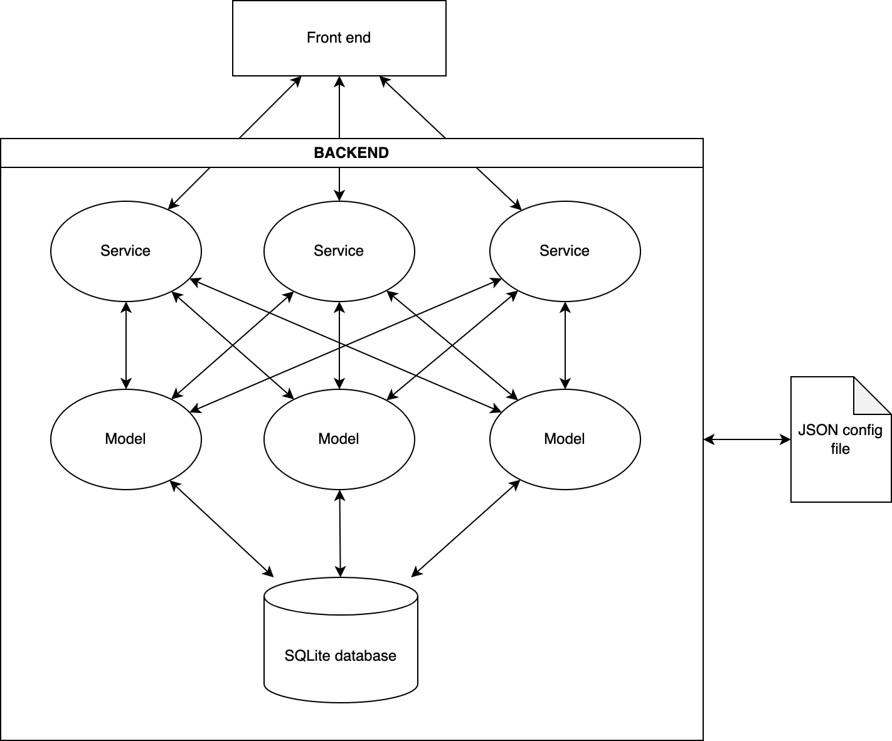

# Was ist ein Zettelkasten und warum brauche ich den?

kurzer Abriss des Zettelkastens, Bibtex Referenzen, Artikel schreiben, Tags und Quer-Referenzen zwischen Notizen und dem Konzept "Schreiben um zu verstehen". Abgrenzung verschiedener Notiz-Typen (Archiv, Recherche und Artikel, kurzfristige Notizen und Ideen)

- https://de.wikipedia.org/wiki/Niklas_Luhmann als Erfinder des Zettelkastens, damals aber noch analog
- sehr gutes Buch zum Thema, allerdings mit vielen Verweisen auf Studien etc: [Sönke Ahrens - Das Zettelkasten-Prinzip (affiliate Link)](https://amzn.to/49KLIuE)[^1]

### Das Zettelkasten-Prinzip kurz erklärt

- atomare Notizen: es werden nur kleine, in sich abgeschlossene und klar abgegrenzte Notizen erstellt um einen Fokus zu behalten. Ausnahme: Zusammenführung der Notizen zum Schreiben eines Artikels, siehe weiter unten Typora 
- "Tags" und eindeutige Bezeichner, bspw. in Form von "unique identifiers" oder "Seriennummern" erlauben die genaue Zuordnung von Notizen und die Zuordnung untereinander. Notizen sollten über Referenzen untereinander vernetzt werden um so auf Dauer ein Netzwerk aus Notizen zu bilden und thematische Querverweise sichtbar zu machen
- Notizen sollten langlebig sein. Es gibt nach dem Konzept von Luhmann verschiedene Typen von Notizen, wichtig sind letztlich aber die Notizen die dauerhaft angelegt werden. 
- Man sollte es vermeiden nur aus Gewohnheit Notizen anzulegen ("Textmarker Syndrom" in Lehrbüchern)
- Nach Luhmann ergibt sich automatisch mit der Zeit eine Organisation der Notizen anhand ihrer Querverweise. Hier weichen wir vom Konzept von Luhmann ab da uns die Technik hier andere Möglichkeiten eröffnet als ein händisch geführter Zettelkasten und wir außerdem bspw. die Möglichkeit nutzen wollen Notizbücher in Joplin komplett zu exportieren.
- Notizen sollten iterativ erstellt und bei neuen Erkenntnissen einer Revision unterzogen werden. Um auf einen vorigen Punkt zurück zu kommen kann man hierdurch auch ab und zu feucht durchwischen und Notizen entfernen die man nicht gebraucht (siehe Textmarker Syndrom).
- Zeichnen Sie alles auf! Dies widerspricht dem vorigen Punkt in gewisser Hinsicht, es geht aber darum auch flüchtige Gedanken erstmal zu notieren und Querverweise zu erstellen da sich hierdurch ggf. ungewöhnliche und vorher unbekannte Verbindungen zwischen Themen ergeben die man vorher nicht gesehen hat. Eine gute Möglichkeit ist es die Notizen in einen Ideen Ordner zu stecken und dort zu sammeln und nach einer gewissen Zeit zu rekapitulieren.
- auch oberflächliche Bezüge herstellen: aus vorigem Grund ergibt sich auch warum man ggf. oberflächliche Verbindungen genauer analysieren sollte und sich ab und an einen Graph seiner Notizen ansehen sollte um ungewöhnliche Verbindungen zu erkennen und ein tieferes Verständnis für Zusammenhänge zu entwickeln
- 

## Schreiben um zu verstehen

Erklärung des Konzeptes aus dem Buch "Writing to learn" von William Zinsser. Weiterer Verweis auf "rubber ducking", also ein besseres Verständnis für ein Thema das man selber erklären oder sogar unterrichten kann

## Gefahren

Eine Gefahr ist dass man anfängt alles, auch Unwichtiges zu notieren und zu protokollieren. Gerade in der digitalen Welt und mit Dingen wie einem Web Clipper neigt man schnell zum hoarding.

## Mögliche Tools

kurzes Beispiel dass Word in 2007 meine B.Sc. gefressen hat, ich damals noch Word 2003 benutzt habe mit .doc Format und die Unsicherheit ob dieses Format noch lange unterstützt wird und wie stabil diese Dateien eigentlich sind wenn die Arbeit damals von der “richtigen” Version schon gefressen wurde

## Warum Joplin?

- open source
- sicher: Joplin supports end-to-end encryption 
- einfache plain text Notizen bzw Markdown und komfortable Live Ansicht des fertigen Artikels
- complete metadata (geolocation, updated time, created time, etc.) und Tags/Keywords
- Import von Evernote und anderen Systemen möglich
- Export in verschiedenste Formate, unter anderem auch einfacher Export ganzer Notizbücher als PDF,Markdown, HTML o.ä.
- Integration von Plugins (insbesondere Webclipper, BibTex, Draw.io, eMail Plugin, Anki Sync)
- Synchronisierung über verschiedene Plattformen mittels Nextcloud/WebDav, Dropbox, Onedrive, GoogleDrive oder einer eigenen Joplin Cloud oder wenn man sich die Mühe nicht machen will geht auch einfach ein S3 Bucket als Ziel
- offline Arbeit ist möglich (keine Web App), Synch erfolgt sobald wieder Internet verfügbar ist
- Kompatibel mit verschiedenen Systemen wie Windows, macOS, Linux, Android, and iOS
- Standalone App ohne Installer (-> einfacher Betrieb auf fremden oder Arbeitsrechnern)
- einfache Integration externer Editoren wie Typora
- Anhängen sämtlicher Dateitypen und direktes Einbinden von gängigen Dateien in den Fließtext (Grafiken, Diagramme, Animationen, Videos usw.)

### Nachteile von Joplin

Der größte Nachteil ist dass Joplin nicht, wie einige andere Notizprogramme, eine einfache flat file Architektur verfolgt sondern ein relativ komplexes Backend inklusive einer SQLite Datenbank verwendet. Ob einen das stört muss man selber entscheiden, für mich haben sich bisher noch keine Nachteile ergeben und man kann auch alle Notizen simpel exportieren. Ein weiterer Nachteil könnte sein dass die Desktop App auf Electron basiert und einen relativ großen Overhead produziert. Bei mir ist es mittlerweile so dass die App durchaus 500MB Ram verbrauchen kann und sich damit für schwachbrüstige Rechner wie einen Raspberry Pi oder ähnliches nur bedingt eignen wird. 

Außerdem gibt es zwar sehr viele Extensions und Plugins für Joplin, diese werden aber zum größten Teil von der Community bzw einzelnen Nutzern entwickelt und schwanken daher in Qualität und Entwicklungsstand erheblich. Andererseits hat man aufgrund der open source Natur von Joplin und seinen Erweiterungen durchaus die Möglichkeit auch selbst Hand anzulegen und entweder eine eigene Erweiterung zu schreiben, oder bestehende Plugins zu verbessern.

## Wie bekomme ich meine Notizen nach Joplin?

- Direkteingabe über die Applikation
- Webclipper -> Clipping von Artikeln
- Als Audio file. Ich benutze dafür den Google Recorder (nur für Pixel Handies?) der eine Transkribierung in Text erlaubt. Danach kann man dann den transkribierten Text oder die Audiodatei mit Joplin über die share Funktionalität teilen und dort eine Notiz anlegen und diese dann ggf. weiter in Joplin bearbeiten

## Zeitmanagement

Wie bekomme ich Informationen möglichst einfach und schnell in mein Notizenprogramm und was sollte ich dort überhaupt notieren?

- Weiterleitung von Mails,
- einfügen von voice Notizen
- eine Notiz für stream of consciousness oder andere kurze Gedanken
- inbox zero gedanke bei Mails etc 

## Risiken und Warnung zur Nutzung und Grenzen	

Es gibt tausende Tools dort draußen, von Notizen Managern wie Joplin über Kalender und Zeitmanagement Apps, Literaturmanagern, Aggregatoren, Todo-Listen und einer Million anderer Themen. Wichtig ist seinem eigenen Workflow treu zu bleiben. Ich selber habe auch schon zig Todo Apps durchprobiert, habe es mit Pomodoro und Zeitmanagement Apps probiert und für mich selber herausgefunden dass ich mit den meisten dieser Apps nichts anfangen kann. Im Gegenteil, viele dieser Apps bringen mich überhaupt erst dazu über Probleme nachzudenken von denen ich nicht wusste dass ich sie angeblich hatte! Dadurch nimmt man sich selbst aber keine Arbeit ab sondern schafft sich höchstens mehr Arbeit. Das Ziel sollte es doch aber sein einem (Denk-) Arbeit abzunehmen.

Ich habe beispielsweise ein paar Tage mit dem Versuch verbracht alle meine verschiedenen Informationsquellen an einem Ort zusammenzuziehen, also Bookmarks, Zitate und Markierungen von Websites bis zu ganzen Artikeln (am Besten mit Zeitstempel oder direkt einer Kopie der ganzen Seite). Vor einer Weile habe ich für diesen Zweck schonmal mit Pocket herumgespielt, bin aber insgesamt wieder davon abgekommen da ich zum einen zum Hoarding neige und praktisch einfach alles zum später lesen abspeichere (um es dann nie wieder anzusehen) und mich außerdem gestört hat dass ich dann neben Joplin noch mindestens einen weiteren Ort habe an dem ich nach Informationen suchen muss.

Jetzt hat mich aber wieder der Ehrgeiz gepackt zu schauen ob ich meinen Workflow noch irgendwie verbessern kann. Dabei habe ich mehrere Apps getestet, namentlich Raindrop, Instapaper und Readwise.

Abgrenzen sollte man eine Notizlösung wie Joplin auch gegen kollaborative Lösungen wie beispielsweise ein Wiki. Grundsätzlich erfüllen Wikis und Notizen Apps in meinen Augen eine ähnliche Funktion (Aufbau einer Wissensdatenbank), Notizen sind aber eher für Einzelpersonen gedacht (die dann ggf. Notizen und Erkenntnisse teilen) während ein Wiki eigentlich immer für die Zusammenarbeit in Gruppen gedacht ist. Deshalb würde ich bei der Auswahl des richtigen Tools, und das betone ich immer wieder, auf den Anwendungsfall schauen bevor man anfängt.

## Handschriftliche Notizen

Momentan fertige ich handschriftliche Notizen auf meinem Tablet, einem [Samsung S6 Lite](https://amzn.to/3TOlpgH), bei dem ich meistens einfach die schlanke, Samsung-eigene Notizen Software verwende. Es gibt noch andere sehr gute Programme die sich beispielsweise (besser) zum annotieren von PDF Dateien wie Büchern, Skripten oder akademischen Papern eignen, aber die sind mir meistens zu überladen.

Nach dem Schreiben exportiere ich die Notizen meistens als einfache Bilddatei und importiere diese dann in Joplin und füge sie in die geeignete Notiz ein. Das ist nicht die eleganteste Lösung, aber funktional und mache ich in der Regel auch nur im Ausnahmefall. Ich habe für mich aber selber festgestellt dass ich handschriftlich (egal ob digital oder auf Papier) kreativer bin und besser denken kann. Sachen wie Rechenaufgaben für die Uni, Workflows und Mindmaps erstelle ich deshalb meistens erst handschriftlich und übertrage diese dann ggf. langfristig in digitale "schöne" Form. Ich finde es auch angenehmer während Vorlesungen oder Besprechungen keinen dicken Laptop vor mir zu haben sondern mir einfach Notizen auf dem Tablet zu machen. Das erscheint mir sozialer (weniger optische Barrieren!), man tippert nicht ständig auf der Tastatur und man hat ggf. noch den "Vorteil" sich zwangsweise im Anschluss nochmal mit der Notiz befassen zu müssen; je nach Art der Besprechung ist das keine schlechte Idee.

## Was noch fehlt

Was mir persönlich noch fehlt ist ein einfacheres System zum Einbinden handschriftlicher Notizen, wie oben dargelegt. Das stört mich aber eigentlich eher periphär und aus Prinzip, behindert mich in meiner konkreten Arbeit aber eigentlich nicht.

Viel störender, gerade in Bezug auf den Grundgedanken des Zettelkastens Notizen und Ideen möglichst atomar zu halten, finde ich meine Neigung dazu mittels Webclipper ganze Artikel und Seiten aus dem Web herunterzuladen. Dass diese Funktion praktisch ist muss nicht diskutiert werden, es widerspricht aber der Natur der atomaren Notizen. 

Ich versuche daher momentan Artikel aus Joplin herauszunehmen und schaue mir dazu unterschiedliche Programme an, namentlich vor allem Instapaper und Pocket. Instapaper gefällt mir sehr wegen seinem schlanken Interface und der Möglichkeit Artikel mit effektivem Zeitstempel zu sichern. Das kann wichtig werden für Forschungsarbeiten. Leider wird diese Option dann wieder dadurch konterkariert dass ein sichern von Artikeln hinter einer Paywall nicht möglich ist. Hier speichert Instapaper leider nur den öffentlich zugänglichen Snippet ab und verweist danach auf den Hauptartikel. Damit ist Instapaper für meinen Anwendungsfall eigentlich fast schon wieder raus, da ich zum Teil doch auf Medien unterwegs bin die einen Bezahlbereich haben.

Pocket hat leider das gleiche Problem und das Interface ist dabei nicht so aufgeräumt und schön. Pocket hat eine andere Zielsetzung und präsentiert einem auf dem Startscreen erstmal eine ganze Batterie an Artikeln von denen das Programm meint sie könnten einem gefallen. Meistens interessiert mich das aber nicht und lenkt nur von der Kernfunktionalität ab die ich suche: Bei Bedarf schnell Artikel zu suchen die ich irgendwann mal zu einem Thema abgespeichert habe und nun referenzieren möchte. Da haut einem insbesondere die Tatsache ins Getriebe dass auch Pocket nicht die ganzen Artikel speichert sondern nur den Anreißer, was schlecht ist wenn man nach Keywords suchen möchte.  

Eine Open Source Alternative scheint [Omnivore](https://omnivore.app/) zu sein. Dieses Programm muss ich mich aber erst noch genau ansehen und momentan scheint es leider auch abseits von einem Blogpost auch keine ausführliche Dokumentation zu geben wie man die Software selber hosten kann. Der Installationsaufwand wäre also vermutlich nicht ganz gering.

Weitere interessante Alternativen sind [Wallabag](https://wallabag.org/), [Hoarder](https://hoarder.app/), die ebenfalls beide Open Source sind. Hoarder scheint allerdings eher eine Art Bookmarking App zu sein die Links auf Medieninhalte wie Bilder, Videos, Artikel etc. mit Text-Snippets und Tags versehen abspeichert. 

Momentan gehe ich noch den umständlichen Weg Artikel die mir gefallen entweder direkt über den Joplin Webclipper (am PC) in ein eigenes Notizbuch zu speichern. Auf mobilen Plattformen, also wenn ich unterwegs auf dem Handy einen interessanten Artikel finde, bookmarke ich diesen über Pocket und füge ihn dann später irgendwann in Joplin ein. Das erfordert natürlich zusätzliche Arbeit und ist leider nicht besonders ergonomisch, hat aber den Vorteil dass man manchmal doch nochmal nachdenkt ob man einen Artikel wirklich speichern muss und sollte.

## welche Notizen und Artikel sollte ich überhaupt behalten?

Joplin verführt einen schnell dazu einfach alles was man findet und was interessant aussieht abzuspeichern und seine eigene, kleine, Knowledgebase zu werfen. Leider auch wenn dies überhaupt keinen Sinn ergibt. Es ist leider eine Unsitte aber auf diese Art kann man sehr einfach sein gesamtes Notizsystem verstopfen und sieht am Ende den Wald vor lauter Bäumen nicht.

Sönke Ahrens verweist in seinem Buch [Das Zettelkasten-Prinzip (affiliate Link)](https://amzn.to/49KLIuE)[^2] darauf dass es 3 Arten von Notizen gibt:

- **Flüchtige Notizen** dienen nur der Gedächtnisstütze und werden nicht aufbewahrt (siehe bspw. all die Markierungen in Artikeln und Büchern die du nie wieder angesehen hast...)
- **Dauerhafte Notizen** ausformulierte und verständliche Notizen die dauerhaft aufbewahrt und nach dem immer gleichen Schema erstellt werden. Aufbewahrung entweder im "Zettelkasten" oder der Literaturverwaltung. (Hier liegt der eigentliche Schatz begraben) 
- **Projektbezogene Notizen** die nur der Gedächtnisstütze für ein Projekt dienen und am Projektende entfernt werden können. Hierzu gehören beispielsweise für mich Hausarbeiten für die Uni, Projektarbeiten für die Arbeit usw. die ich, anstatt in Joplin, in einem geeigneten Programm wie Todoist ablege und dort mit Verfalls- und/oder Abgabedatum versehe.

Nun stellt sich natürlich die Frage wie man dazu kommt seinen digitalen Zettelkasten am Besten nur mit den dauerhaften Notizen zu füllen, und diese am Besten nach einem möglichst stringenten Muster erstellt und über Keywords und andere Metadaten vernünftig indexier- und suchbar macht. 

Zuerst einmal besteht die größte Gefahr darin alle Notizen wie dauerhafte Notizen zu behandeln. Der Vorteil daran ist dass keine Idee und kein Geistesblitz einem abhanden kommt wenn man seine Notizen wie eine Art Tagebuch führt. Der große Nachteil ist aber dass dadurch keine Selektion mehr stattfindet und man wahllos Notizen ohne Vorauswahl erstellt worunter sowohl Qualität als auch Übersichtlichkeit leiden. Wenn man alles aufschreibt dann gehen die guten Ideen ganz schnell zwischen den schlechten unter und das wollen wir, gerade bei einem *dauerhaften* Wissensspeicher natürlich vermeiden.

Das zweite Problem besteht darin die Notizen als projektbezogen zu deklarieren die man eigentlich wiederverwenden könnte. Auch dieser Fall sollte relativ klar sein, denn häufig trifft man beim Arbeiten an einem Projekt natürlich auch auf Fragen oder Sachverhalte die auch in einem anderen Kontext relevant sein können. Hier gilt es also abzuwägen ob es sich nicht doch lohnt eine Notiz als dauerhafte Notiz aufzuarbeiten.

Wie lösen wir das Problem nun?

Ich für meinen Teil schreibe trotzdem alles, oder wenigstens viel, auf. Trotzdem trenne ich meinen dauerhaften Zettelkasten von den alltäglichen Ideen und übertrage diese erst wenn ich sie gesichtet und in Ruhe überdacht habe. Ganz konkret haben sich dafür drei Wege bei mir etabliert:

- Reisenotizbücher im A6 Format für schnelle handschriftliche Skizzen oder Notizen
-  Voice Recordings auf dem Smartphone
- eine eigene "Schmierennotiz" in Joplin in die ich wahllos Dinge eintrage, Fotos einfüge usw.

Alle diese Varianten haben Vor- und Nachteile, ich benutze immer worauf ich gerade Lust habe und was der Situation angemessen erscheint.

Größter Vor- und Nachteil dieses Systems ist natürlich dass ich doppelte Arbeit habe: ich schreibe alles auf, nur um dann in der Nachlese doch wieder Teile wegzuwerfen, aufzuräumen, aufzuhübschen.

Für mich überwiegen aber die Vorteile indem ich einfach unterwegs ohne großes Nachdenken Geistesblitze einfangen und niederschreiben kann ohne mich groß darum zu kümmern ob meine Idee nun wirklich genial ist oder nicht. 

### Reisenotizbücher, Schmierzettel, Post-its

Die A6 Notizbücher nutze ich für Notizen die ich "in dem Moment" interessant finde, aber nicht dauerhaft in mein Ablagesystem übertragen möchte. Ich schreibe zum Beispiel öfter meine Eindrücke über ein gutes Essen, die Geschmacksnoten von einer neuen Sorte Wein oder einfach alltägliche Eindrücke auf. Eine Art Log meines Lebens quasi. Nichts was ich "produktiv" verwerten würde, aber ich sammle gerne diese kleinen Belanglosigkeiten. Die A6 Hefte sichte ich wenn ich eins voll habe, übertrage die Guten Sachen in Joplin und sammle die physischen Notizbücher danach in einem Schuhkarton für die Nachwelt. 

Ich kann diese Praxis nur jedem empfehlen, es hat etwas sehr meditatives sich diese kleinen Gedanken von der Seele zu schreiben und das kleine Format zwingt einen zur Prägnanz. Außerdem kann es sehr erhellend und spannend sein nach ein paar Monaten oder Jahren nochmal durch die Heftchen zu blättern und sich vor Augen zu führen was einen damals bewegt hat. 

Ich halte es dabei sehr simpel und notiere vor einer Notiz einfach Datum und Ort, falls relevant. Ansonsten trenne ich Einträge einfach durch einen Spiegelstrich. Auf der ersten Seite des Heftchens notiere ich immer das Jahr, die Buchnummer für das Jahr und wann ich begonnen habe in das Buch zu schreiben so dass eine sehr simple Chronik entsteht. Ich benötige normalerweise 4-6 Wochen bis so ein Buch voll ist und sichte dann ein- bis zweimal im Monat die neuen Einträge, je nachdem wann ich dazu mal Lust habe.  

Natürlich kann man dieses Vorgehen auch mit Schmierzetteln, Post-its oder auf der Rückseite von alten Briefumschlägen nutzen, aber ich finde es aufgeräumter in Form dieser Büchlein und die Kosten halten sich auch im Rahmen.

#### Überlegungen zum Übertragen handschriftlicher Notizen nach Joplin

Um Notizen zu übertragen gehe ich normalerweise einen ganz einfachen Weg: Ich tippe sie ab.

Das mag nicht besonders elegant und tech-affin wirken, ist aber meistens die schnellste Variante. Wegen meiner *ahem* nicht so gut lesbaren Handschrift, hatte ich mit OCR bisher nur sehr durchwachsenen Erfolg (auch wenn es dazu in Joplin durchaus Extensions gibt!). 

Man könnte die Seiten natürlich auch einfach als Bilder einscannen/einfügen aber dann wäre unser kompletter Vorteil dahin Notizen durchsuchbar zu machen. Schlimmer noch: Weil wir in einem digitalen Notizbuch davon ausgehen dass alle Notizen durchsuchbar sein sollen würden reine Bild-Notizen unser System ausheben und bestimmte Notizen ggf. bei Recherchen "unsichtbar" machen weil hier schlicht kein Text durchsucht werden kann.

Je nach Komplexität und Aufwand schreibe ich also die interessanten Notizen und Ideen nochmal ab und überarbeite diese ggf. nochmal. Skizzen füge ich dann tatsächlich wahlweise als Scan ein oder baue diese ebenfalls nochmal in Draw.io nach wenn es schön sein soll (nimmt einem eventuell auch Arbeit für spätere Veröffentlichungen ab).

# Notizen zum Artikel schreiben

Weitere Ideen um den Artikel zu erweitern:

- Einbinden und Scannen handschriftlicher Notizen. Youtube Videos zur Recherche dazu:
- https://www.youtube.com/watch?v=9T9VL8_i1Tg&ab_channel=CyanVoxel
- https://www.youtube.com/watch?v=tHF8bwVJ--4&ab_channel=TiagoForte
    - ChatGPT V4 vorrausgesetzt, momentan noch kostenpflichtig. Eine Alternative wäre Google Lens, ist auch auf dem Handy enthalten. Eventuell mal prüfen
    - https://www.youtube.com/watch?v=KPCCK9Zz3H0&ab_channel=Aitrepreneur
- Export/Import beschreiben?
- Weiter eingehen auf den Prozess beim Notizen schreiben und die unterschiedlichen Arten wie man Notizen schreibt:
    - geplant, beispielsweise während einer Recherche zu einem Thema
    - spontan, beispielsweise unterwegs, beim Sport, im Café etc.
        - deshalb: mehrere Medien vorhalten damit man Reibung reduziert und einfach eine Notiz erstellen kann: ich führe immer das Handy mit, kann dort direkt in Joplin Notizen anlegen, eine Sprachnachricht aufnehmen und habe zusätzlich auch Stift und Papier falls ich darauf Lust habe oder es mehr Sinn macht (bspw. Diagramme oder Skizzen o.ä.)

- cross-referencing mit anderen Tools, beispielsweise Besprechungsnotizen, Todos oder Notizen mit Verfallsdatum (Erinnerungen, Einkaufszettel usw.) mit Todoist via Joplin Plugin, 
- Literaturverwaltung mittels Zotero bzw. BibTex Dateien
- Joplin mit Templates automatisieren
- custom css in Notizen, siehe https://discourse.joplinapp.org/t/how-to-change-css-style-for-inline-code-block/11210
- Flow Charts einfügen mit Mermaid https://dompl.medium.com/produce-great-looking-flowcharts-in-seconds-7f3bea64f2e2
- Interessanter Artikel der beschreibt wie man digital mit Papier kombinieren kann und warum: https://todoist.com/de/productivity-methods/medium-method
- Vorteile handschriftlicher Notizen: 
    - https://www.scientificamerican.com/article/a-learning-secret-don-t-take-notes-with-a-laptop/
    - https://www.scientificamerican.com/article/why-writing-by-hand-is-better-for-memory-and-learning/

## Fußnoten und Referenzen

[^1]:Ahrens, Sönke. *Das Zettelkasten-Prinzip: Erfolgreich wissenschaftlich Schreiben und Studieren mit effektiven Notizen*. Norderstedt: BoD Books on Demand 2017.
[^2]:Ahrens, Sönke. S. 41.

