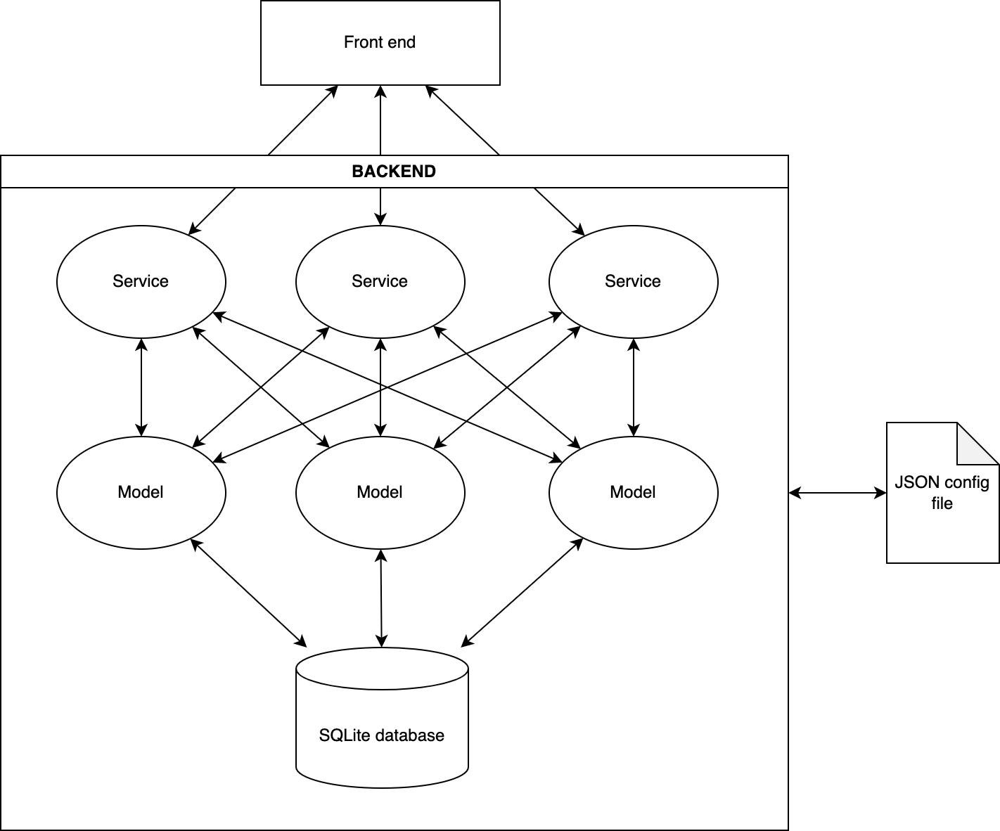

# Was ist ein Zettelkasten und warum brauche ich den?

kurzer Abriss des Zettelkastens, Bibtex Referenzen, Artikel schreiben, Tags und Quer-Referenzen zwischen Notizen und dem Konzept "Schreiben um zu verstehen". Abgrenzung verschiedener Notiz-Typen (Archiv, Recherche und Artikel, kurzfristige Notizen und Ideen)

- https://de.wikipedia.org/wiki/Niklas_Luhmann als Erfinder des Zettelkastens, damals aber noch analog
- sehr gutes Buch zum Thema, allerdings mit vielen Verweisen auf Studien etc: [Sönke Ahrens - Das Zettelkasten-Prinzip (affiliate Link)](https://amzn.to/49KLIuE)

### Das Zettelkasten-Prinzip kurz erklärt

- atomare Notizen: es werden nur kleine, in sich abgeschlossene und klar abgegrenzte Notizen erstellt um einen Fokus zu behalten. Ausnahme: Zusammenführung der Notizen zum Schreiben eines Artikels, siehe weiter unten Typora 
- "Tags" und eindeutige Bezeichner, bspw. in Form von "unique identifiers" oder "Seriennummern" erlauben die genaue Zuordnung von Notizen und die Zuordnung untereinander. Notizen sollten über Referenzen untereinander vernetzt werden um so auf Dauer ein Netzwerk aus Notizen zu bilden und thematische Querverweise sichtbar zu machen
- Notizen sollten langlebig sein. Es gibt nach dem Konzept von Luhmann verschiedene Typen von Notizen, wichtig sind letztlich aber die Notizen die dauerhaft angelegt werden. 
- Man sollte es vermeiden nur aus Gewohnheit Notizen anzulegen ("Textmarker Syndrom" in Lehrbüchern)
- Nach Luhmann ergibt sich automatisch mit der Zeit eine Organisation der Notizen anhand ihrer Querverweise. Hier weichen wir vom Konzept von Luhmann ab da uns die Technik hier andere Möglichkeiten eröffnet als ein händisch geführter Zettelkasten und wir außerdem bspw. die Möglichkeit nutzen wollen Notizbücher in Joplin komplett zu exportieren.
- Notizen sollten iterativ erstellt und bei neuen Erkenntnissen einer Revision unterzogen werden. Um auf einen vorigen Punkt zurück zu kommen kann man hierdurch auch ab und zu feucht durchwischen und Notizen entfernen die man nicht gebraucht (siehe Textmarker Syndrom).
- Zeichnen Sie alles auf! Dies widerspricht dem vorigen Punkt in gewisser Hinsicht, es geht aber darum auch flüchtige Gedanken erstmal zu notieren und Querverweise zu erstellen da sich hierdurch ggf. ungewöhnliche und vorher unbekannte Verbindungen zwischen Themen ergeben die man vorher nicht gesehen hat. Eine gute Möglichkeit ist es die Notizen in einen Ideen Ordner zu stecken und dort zu sammeln und nach einer gewissen Zeit zu rekapitulieren.
- auch oberflächliche Bezüge herstellen: aus vorigem Grund ergibt sich auch warum man ggf. oberflächliche Verbindungen genauer analysieren sollte und sich ab und an einen Graph seiner Notizen ansehen sollte um ungewöhnliche Verbindungen zu erkennen und ein tieferes Verständnis für Zusammenhänge zu entwickeln
- 

## Schreiben um zu verstehen

Erklärung des Konzeptes aus dem Buch "Writing to learn" von William Zinsser. Weiterer Verweis auf "rubber ducking", also ein besseres Verständnis für ein Thema das man selber erklären oder sogar unterrichten kann

## Gefahren

Eine Gefahr ist dass man anfängt alles, auch Unwichtiges zu notieren und zu protokollieren. Gerade in der digitalen Welt und mit Dingen wie einem Web Clipper neigt man schnell zum hoarding.

## Mögliche Tools

kurzes Beispiel dass Word in 2007 meine B.Sc. gefressen hat, ich damals noch Word 2003 benutzt habe mit .doc Format und die Unsicherheit ob dieses Format noch lange unterstützt wird und wie stabil diese Dateien eigentlich sind wenn die Arbeit damals von der “richtigen” Version schon gefressen wurde

## Warum Joplin?

- open source
- sicher: Joplin supports end-to-end encryption 
- einfache plain text Notizen bzw Markdown und komfortable Live Ansicht des fertigen Artikels
- complete metadata (geolocation, updated time, created time, etc.) und Tags/Keywords
- Import von Evernote und anderen Systemen möglich
- Export in verschiedenste Formate, unter anderem auch einfacher Export ganzer Notizbücher als PDF,Markdown, HTML o.ä.
- Integration von Plugins (insbesondere Webclipper, BibTex, Draw.io, eMail Plugin, Anki Sync)
- Synchronisierung über verschiedene Plattformen mittels Nextcloud/WebDav, Dropbox, Onedrive, GoogleDrive oder einer eigenen Joplin Cloud oder wenn man sich die Mühe nicht machen will geht auch einfach ein S3 Bucket als Ziel
- offline Arbeit ist möglich (keine Web App), Synch erfolgt sobald wieder Internet verfügbar ist
- Kompatibel mit verschiedenen Systemen wie Windows, macOS, Linux, Android, and iOS
- Standalone App ohne Installer (-> einfacher Betrieb auf fremden oder Arbeitsrechnern)
- einfache Integration externer Editoren wie Typora
- Anhängen sämtlicher Dateitypen und direktes Einbinden von gängigen Dateien in den Fließtext (Grafiken, Diagramme, Animationen, Videos usw.)

### Nachteile von Joplin

Der größte Nachteil ist dass Joplin nicht, wie einige andere Notizprogramme, eine einfache flat file Architektur verfolgt sondern ein relativ komplexes Backend inklusive einer SQLite Datenbank verwendet. Ob einen das stört muss man selber entscheiden, für mich haben sich bisher noch keine Nachteile ergeben und man kann auch alle Notizen simpel exportieren. Ein weiterer Nachteil könnte sein dass die Desktop App auf Electron basiert und einen relativ großen Overhead produziert. Bei mir ist es mittlerweile so dass die App durchaus 500MB Ram verbrauchen kann und sich damit für schwachbrüstige Rechner wie einen Raspberry Pi oder ähnliches nur bedingt eignen wird. 

Außerdem gibt es zwar sehr viele Extensions und Plugins für Joplin, diese werden aber zum größten Teil von der Community bzw einzelnen Nutzern entwickelt und schwanken daher in Qualität und Entwicklungsstand erheblich. Andererseits hat man aufgrund der open source Natur von Joplin und seinen Erweiterungen durchaus die Möglichkeit auch selbst Hand anzulegen und entweder eine eigene Erweiterung zu schreiben, oder bestehende Plugins zu verbessern.

## Wie bekomme ich meine Notizen nach Joplin?

- Direkteingabe über die Applikation
- Webclipper -> Clipping von Artikeln
- Als Audio file. Ich benutze dafür den Google Recorder (nur für Pixel Handies?) der eine Transkribierung in Text erlaubt. Danach kann man dann den transkribierten Text oder die Audiodatei mit Joplin über die share Funktionalität teilen und dort eine Notiz anlegen und diese dann ggf. weiter in Joplin bearbeiten

## Zeitmanagement

Wie bekomme ich Informationen möglichst einfach und schnell in mein Notizenprogramm und was sollte ich dort überhaupt notieren?

- Weiterleitung von Mails,
- einfügen von voice Notizen
- eine Notiz für stream of consciousness oder andere kurze Gedanken
- inbox zero gedanke bei Mails etc 

## Risiken und Warnung zur Nutzung und Grenzen	

Es gibt tausende Tools dort draußen, von Notizen Managern wie Joplin über Kalender und Zeitmanagement Apps, Literaturmanagern, Aggregatoren, Todo-Listen und einer Million anderer Themen. Wichtig ist seinem eigenen Workflow treu zu bleiben. Ich selber habe auch schon zig Todo Apps durchprobiert, habe es mit Pomodoro und Zeitmanagement Apps probiert und für mich selber herausgefunden dass ich mit den meisten dieser Apps nichts anfangen kann. Im Gegenteil, viele dieser Apps bringen mich überhaupt erst dazu über Probleme nachzudenken von denen ich nicht wusste dass ich sie angeblich hatte! Dadurch nimmt man sich selbst aber keine Arbeit ab sondern schafft sich höchstens mehr Arbeit. Das Ziel sollte es doch aber sein einem (Denk-) Arbeit abzunehmen.

Ich habe beispielsweise ein paar Tage mit dem Versuch verbracht alle meine verschiedenen Informationsquellen an einem Ort zusammenzuziehen, also Bookmarks, Zitate und Markierungen von Websites bis zu ganzen Artikeln (am Besten mit Zeitstempel oder direkt einer Kopie der ganzen Seite). Vor einer Weile habe ich für diesen Zweck schonmal mit Pocket herumgespielt, bin aber insgesamt wieder davon abgekommen da ich zum einen zum Hoarding neige und praktisch einfach alles zum später lesen abspeichere (um es dann nie wieder anzusehen) und mich außerdem gestört hat dass ich dann neben Joplin noch mindestens einen weiteren Ort habe an dem ich nach Informationen suchen muss.

Jetzt hat mich aber wieder der Ehrgeiz gepackt zu schauen ob ich meinen Workflow noch irgendwie verbessern kann. Dabei habe ich mehrere Apps getestet, namentlich Raindrop, Instapaper und Readwise.

Abgrenzen sollte man eine Notizlösung wie Joplin auch gegen kollaborative Lösungen wie beispielsweise ein Wiki. Grundsätzlich erfüllen Wikis und Notizen Apps in meinen Augen eine ähnliche Funktion (Aufbau einer Wissensdatenbank), Notizen sind aber eher für Einzelpersonen gedacht (die dann ggf. Notizen und Erkenntnisse teilen) während ein Wiki eigentlich immer für die Zusammenarbeit in Gruppen gedacht ist. Deshalb würde ich bei der Auswahl des richtigen Tools, und das betone ich immer wieder, auf den Anwendungsfall schauen bevor man anfängt.
